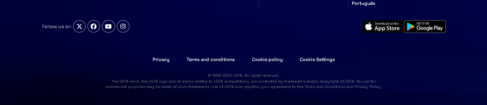

UEFA Championship League Website Clone ⚽️🏆

🎯 Project Overview
Welcome to the UEFA Championship League Website Clone, a project dedicated to replicating the design and functionality of the official UEFA Championship League website. This project showcases the teamwork, creativity, and technical skills of our development team in recreating an interactive and responsive sports website.
The UEFA Championship League Clone was assigned as a major project by Geekster, aimed at testing our ability to handle complex web development tasks, including dynamic content presentation, responsive design, and user experience optimization.

This project was led by Ayush Kohre and developed in collaboration with a talented team of six members:

🟢 Meet the Development Team 
Our UEFA Championship League Website Clone was meticulously crafted by a dedicated and talented team of front-end developers. Each member contributed their unique expertise to various aspects of the website, focusing on delivering an engaging user interface using only HTML and CSS. While the project is not yet fully responsive, we are continuously improving to ensure optimal viewing experiences across devices.

1. Ayush Kohre – Project Lead & Front-End Developer
As the leader, Ayush spearheaded the project, ensuring that the Landing Page and Statistics Page were aesthetically appealing and aligned with the client’s vision. His guidance was instrumental in streamlining the development process.

2. Adarsh – User Interface & Content Structure Specialist
Adarsh designed the Login Page and Matches Page, focusing on clear content presentation and intuitive navigation to provide users with easy access to essential tournament details.

3. Payal – Multimedia Content Specialist
Payal handled the UEFA.com Page and Video Section, ensuring that multimedia content was well-integrated and engaging, enhancing the overall user experience.

4. Vivek – Data Presentation Specialist
Vivek was responsible for the Table and Teams Page, organizing key data into easily digestible formats. His work ensures that users can access critical information such as team rankings with ease.

5. Surrendra – User Interaction & Informational Content Developer
Surrendra worked on the Favorites and About Pages, providing users with features to personalize their experience and gain insights about the tournament.

6. Dinesh – News & Update Coordinator
Dinesh developed the News Page, curating the latest information to keep users up to date with all relevant tournament happenings.

7. Taha – Interactive Elements Specialist
Taha created the Gaming Page and conceptualized the New Format section, enhancing the site’s interactive features to engage users beyond just browsing content.

Though the project is still a work in progress in terms of full responsiveness, the team is committed to refining the design for enhanced usability across various screen sizes.

🚀 Features

📌 Skilled Front-End Developers: Our team comprises highly talented front-end developers, skilled in building visually appealing and user-friendly web pages using HTML and CSS. Each team member contributed to specific sections of the website, ensuring the best possible user experience within the project's scope.

📌 Interactive User Experience: Special attention was given to enhancing user interactivity, with subtle hover effects and animations incorporated by the project lead, Ayush Kohre, particularly on the Landing Page and Statistics Page. These elements create a more engaging and dynamic browsing experience.

📌 Focused Content & Layout Design: The UEFA Championship League Clone prioritizes delivering an intuitive layout and a clean interface that mirrors the design of the original site. While the website currently uses only HTML and CSS, it remains visually consistent and functional, offering easy navigation and access to key content such as team statistics, match results, and more.

📌 Static Website with Future Expansion Plans: The project does not yet include backend functionality or complex responsiveness across all devices. However, plans for future updates include expanding compatibility and improving responsiveness for mobile devices, tablets, and smaller screens.

📌 Basic Responsiveness: Although not fully responsive, the website design is adaptable for some screen sizes, ensuring basic accessibility on larger displays such as desktops and laptops.

🟢 Project Assigned
- UEFA Championship League Website Clone

* Landing Page
* Login Page
* Matches Page
* UEFA.com Page
* Video Section
* Table Page
* Teams Page
* Favorites Page
* About Page
* News Page
* Gaming Page
* New Format Page
* Statistics Page

🟢 Acknowledgment
I would like to express my sincere gratitude to everyone who contributed to the development of the UEFA Championship League Website Clone. Your dedication and hard work on each section of the project have been invaluable in bringing this vision to life. A special thanks to our mentor Abhinandan for his guidance and support throughout the process.

🟢 Project Contributors
1. Ayush Kohre (Team Lead)
2. Adarsh
3. Payal
4. Vivek
5. Surrendra
6. Dinesh
7. Taha
   
🟢 Project Lead
Ayush Kohre: Project Lead, responsible for overseeing the development of the UEFA Championship League Website Clone and ensuring alignment with the original website's vision, while fostering collaboration among team members.

🟢 Special Thanks
We extend our heartfelt gratitude to the original UEFA Championship League website development team for creating an inspiring platform that served as the foundation for this project. Your work motivated us to replicate and enhance the experience for our users.

🟢 Special Acknowledgment to My Mentor
I would like to express my deep appreciation to my mentor, Abhinandan, whose unwavering support and expert guidance were instrumental in navigating the complexities of the UEFA Championship League Website Clone project. Your encouragement and valuable feedback greatly contributed to our success.

🟢 Learning Resources
We would like to extend our sincere gratitude to Geekster for offering exceptional learning resources that empowered us with the skills and knowledge essential for the successful execution of the UEFA Championship League Website Clone. Your support has been pivotal in enhancing our development journey.

🎯 Contributing
We welcome contributions to improve the UEFA Championship League Website Clone! Your input is invaluable in enhancing the project's functionality and user experience. If you’d like to contribute, please follow these steps:

1. Fork the Repository: Create a fork of the repository to your own GitHub account.
2. Create a New Branch: Establish a new branch for your feature or bug fix.
3. Make Changes: Implement your proposed changes or additions.
4. Commit Changes: Commit your changes with clear and descriptive messages.
5. Push Changes: Push your changes to your forked repository.
6. Open a Pull Request: Submit a pull request detailing the modifications you’ve made.
* Thank you for your interest in contributing!
  
🟢 Credits
UEFA Championship League: We would like to acknowledge the original UEFA Championship League website for serving as our inspiration throughout this project. For more information and to experience the official content, visit [ https://www.uefa.com/uefachampionsleague/ ].

🖥️ Technology Used
📌 HTML: Utilized for structuring the content and layout of web pages.
📌 CSS: Employed for styling and improving the visual aesthetics of the website.

🟢 Installation
Follow these simple steps to set up the UEFA Championship League Website Clone on your local machine:

1. Clone the Repository:
   git clone https://github.com/Ash-dot-coder/M3-Project-UEFA.git
2. Navigate to the Project Directory:
   cd Project UEFA
3. Open in Web Browser:
   Open the index.html file in your preferred web browser to start exploring the UEFA Championship League Website Clone.

    🔥 https://uefachampionshipleague7.netlify.app/  🔥

    🔥Screenshots    
    
🟢UEFA.com Page:

🟢Login Page:

🟢Home Page:

🟢Matches Page:

🟢Table Page:

🟢Video Page:

🟢Gaming Page:

🟢Statistic Page:

🟢Team Page:

🟢New Format Page:

🟢News Page:

🟢About Page:

🟢Favourite Page:

